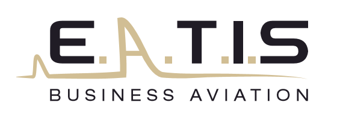

#  Aviation d'affaire

Aviation d’affaires ou aviation privée au départ de Strasbourg, région Grand Est ou Aéroports régionaux environnants, Eatis Business Aviation vous emmène vers plus de 1000 destinations dans un rayon d’action d’environ 2200km.
Nous mettons à la disposition de nos clients, le jet d’affaires léger le plus avancé et le plus rapide au monde. Ainsi, vous gagnez du temps dans vos voyages professionnels ou vols privés, atterrissez au plus près de votre destination et évitez les contraintes d’attentes à l’embarquement
Compétence, suivi et expérience des pilotes EATIS, vous garantiront un vol serein avec un haut niveau de sécurité.
Le fuselage du HondaJet offre une augmentation de l’espace de la cabine dont les équipements sont modernes et haut de gamme. Le confort de la cabine s’organise en espace de travail, en espace de réflexion ou en espace détente.
Pour vos vols entreprise ou pour vous évader le temps d’un week-end, Eatis met également à votre disposition un bimoteur DA-42.

Contactez nous pour toutes vos demandes

::: warning Infos
Les aéronefs sont tous exploités sous AOC Aircraft Operator Certificate, délivré par l’aviation civile française
:::

