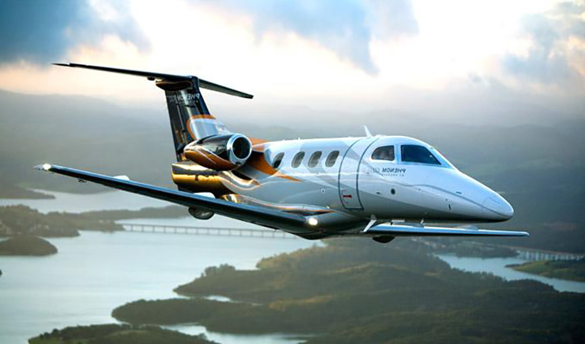
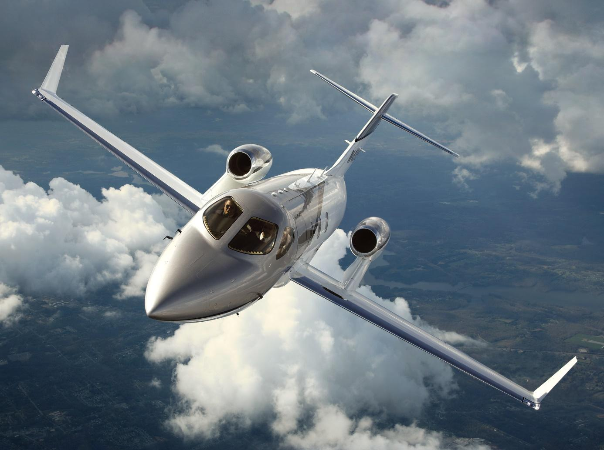

# Qualifications de pilotes

##  MCC JOC

### Description 

**La qualification MCC, Multi Crew Coordination – Formation Coordination de l’Équipage, a pour objectif de vous apprendre le travail en équipage et aussi d’appréhender les concepts facteurs humains selon la méthode des plus grandes compagnies aériennes.**

Dispensée par des professionnels expérimentés, la qualification MCC est en permanente évolution. Elle a pour but en premier lieu d’assurer la meilleure transition possible vers votre première qualification de type JAR25 (Joint Aviation Requirements).

### La formation vous permettra :
D’obtenir les compétences requises pour exercer les fonctions de commandant de bord et aussi de copilote sur tout avion exploité multipilote en transport aérien ainsi, vous apprendrez à travailler en équipage.

### Compétences développées :

- S’entraînner à la prise de décision
- La communication
- La répartition des tâches
- L’utilisation des guides et check-list
- Le contrôle mutuel
- L’esprit d’équipe

### Le déroulement de la formation
- Tout d’abord, une formation théorique : 25 heures de cours (facteurs humains, travail en équipage, système et utilisation Avion catégorie Medium Jet)
- Enfin, une formation pratique : 20 heures sur simulateur ALX FNPT II MCC modèle de Vol A 319 (dont 10 heures de PF et 10 heures de PM)

::: tip Conditions d'accès :

- La licence de pilote professionnel CPL en état de validité
- La qualification de vol aux instruments (IR-ME) en état de validité

:::

### Durée et fréquence de la formation
- 2 semaines
- Session tous les 15 jours à compter de Mars 2017

##  Instruments IRSE IRME

**La qualification instruments IRSE IRME ( IRSE monomoteur, IRME multimoteurs) permet aux titulaires d’une licence de pilote privé PPL ou professionnel CPL, de piloter partout dans le monde.**

Par conséquent, en tant que pilote privé vous pouvez passer l’une ou l’autre de ces qualifications et ensuite faire de l’IFR sur mono et/ou multi moteurs dans un cadre privé. Le choix d’une qualification IRSE ou IRME se fera en fonction de vos envies et aussi de vos moyens, les différences de coût de formation, d’heure de vol et de prorogation ne sont pas négligeables.

### Description de la formation sur Monomoteur (IRSE) :
- 35 heures de simulateur en double commande (FNPT II)
- 15 heures de vol en double commande sur DA 40 G1000
- 50 h de briefing et de défriefing effectués par l’instructeur

### Description de la formation sur Bimoteur (IRME) :
- 40 heures de simulateur en double commande (FNPT II)
- 15 heures de vol en double commande sur DA 42 VI
- 55 h de briefing et de défriefing effectués par l’instructeur

::: tip Conditions d'accès :
- Satisfaire à l’évaluation théorique et pratique en entrée de stage et être titulaire des certificats théoriques de l’IR (7 certificats) ou de l’ATPL (14 certificats) avec au moins encore 6 mois de validité.

Détenir :

- Une licence PPL(A) ou CPL(A)
- Une expérience de 50 hdv en campagne en tant que CDB
- Une habilitation au vol de nuit
- Un certificat médical de classe 1 ou 2
- Le certificat FCL.055D (Aptitude à la langue anglaise)
- Une qualification Multi Moteur dans le cas d’un IRME.
:::

##  Instruments CB IR

**Pour obtenir la qualification instruments CB IR, il est nécessaire de suivre une formation approfondie en météorologie et un entraînement en vol aux instruments sans aucune référence visuelle extérieure afin de pouvoir voler dans des conditions météorologiques dégradées partout dans le monde.**

 Vous devrez premièrement réaliser un stage initial dans notre école de Strasbourg de 4 jours pour l’IR, Instrument Rating / vol aux instruments et deuxièmement un stage de 2 jours pour la formation à la qualification instruments CB IR (ancien IR national)

### Possibilité de suivre la formation sur site ou à distance
- 4 rentrées par an, nous consulter.

#### Sur site :
- 92 heures de cours théoriques pour préparer les 7 certificats théoriques
- Utilisation de nos FSTD pour certaines applications pratiques de nos cours théoriques
- Recueil de QCM et préparation à l’examen
- Planning adapté selon la disponibilité du stagiaire
- Durée de la formation : de 2 à 18 mois au maximum

#### A distance :
- Stage initial de 2 jours de théorie (11 heures)
- Parcours pédagogique et assistance sur plateforme Internet.
- Réalisation de devoirs et examens blancs (envoi et correction par Internet).
- Entrainement aux QCM en reproduisant les conditions de l’examen théorique.

### Formation pratique sur Monomoteur : IR SE

- 25 heures de simulateur en double commande (FNPT II)
- 15 heures de vol en double commande sur DA 40 G1000
- 40 h de briefing et de défriefing effectués par l’instructeur

### Formation pratique sur Bimoteur : IR ME
- 30 heures de simulateur en double commande (FNPT II)
- 15 heures de vol en double commande sur DA 42 VI
- 45 h de briefing et de défriefing effectués par l’instructeur

::: tip Conditions d’accès :

- Être détenteur d’une licence PPL (A) avec la qualification SEP en cours de validité et également une variante EFIS.
- Avoir la qualification MEP dans le cas d’une formation multi moteur.
- Une expérience de 50 heures de vol en campagne en tant que CDB
- Une habilitation au vol de nuit (si nécessité de pratiquer l’IFR de nuit)
- Un certificat médical de classe 1 ou 2
- Avoir la qualification FCL.055D (Aptitude à la langue anglaise)
- Satisfaire à une évaluation théorique et pratique sur simulateur

:::

### En conclusion :

Par ailleurs l’examen final se traduit par une épreuve pratique, conduite par un examinateur habilité. L’épreuve pratique se divise en cinq ou six sections. En outre, en cas d’échec à l’une de ces sections, il est possible de repasser cette dernière au cours des 6 mois suivants ; en revanche, plus d’un échec conduit automatiquement à repasser l’examen intégralement. Enfin, une fois admis, le candidat reçoit une attestation provisoire valable pendant deux mois.

##  QT PHENOM 100-300 SPO/MPO

### Programme de la formation :

#### Formation théorique se décomposant sur 49heures :

- 38 heures de cours théoriques
- 6 heures de formations statiques
- 3 heures de formations sur l’utilisation G1000-G3000/FMS
- 2 heures de QCM qui permettent de valider les cours théoriques

#### Formation pratique :

- 3 heures de FSTD (ALX FR3108
- 13h de vol sur Phenom 100
- 32 briefing et debriefing

Durée de la formation : 3 semaines

::: tip Conditions d’accès :

- Avoir effectué au moins 200 heures d’expérience totale en vol, dont 70 heures en tant que PIC sur avions
- Être titulaires d’un certificat attestant qu’ils ont suivi de manière satisfaisante un cours théorique additionnel auprès d’un ATO ou avoir réussi les examens théoriques de l’ATPL(A) ou en plus d’une licence, être titulaires d’une ATPL(A) ou d’une CPL(A)/IR avec un crédit de connaissances théoriques pour l’ATPL(A)
- Être titulaire d’un IRME en cours de validité
- Avoir le certificat médical Classe 1 et 2

:::

##  Qt HONDA 420 SPO/MPO

### Programme de la formation :
#### Formation théorique se décomposant sur 49heures :

- 38 heures de cours théoriques
- 6 heures de formations statiques
- 3 heures de formations sur l’utilisation G1000-G3000/FMS
- 2 heures de QCM qui permettent de valider les cours théoriques

#### Formation pratique :

- 3 heures de FSTD (ALX FR3108
- 13h de vol sur HA- 420
- 32 briefing et debriefing

Durée de la formation : 3 semaines

::: tip Conditions d’accès :

- Avoir effectué au moins 200 heures d’expérience totale en vol, dont 70 heures en tant que PIC sur avions
- Être titulaires d’un certificat attestant qu’ils ont suivi de manière satisfaisante un cours théorique additionnel auprès d’un ATO ou avoir réussi les examens théoriques de l’ATPL(A) ou en plus d’une licence, être titulaires d’une ATPL(A) ou d’une CPL(A)/IR avec un crédit de connaissances théoriques pour l’ATPL(A)
- Être titulaires d’un certificat attestant avoir suivi de manière satisfaisante un cours théorique additionnel auprès d’un ATO ou voir réussi les examens théoriques de l’ATPL(A) ou en plus d’une licence, être titulaires d’une ATPL(A) ou d’une CPL(A)/IR avec un crédit de connaissances théoriques pour l’ATPL(A)
- Être titulaire d’un IRME en cours de validité
- Avoir le certificat médical Classe 1 et 2

:::

##  Vol de nuit

**La Qualification vol de nuit vous permet de voler durant la nuit aéronautique selon les règles du vol VFR. Par ailleurs vous aurez l’obligation de choisir pour le départ et l’arrivée des aérodromes homologués pour accueillir le vol de nuit. Elle apporte par conséquent un complément particulièrement intéressant à la licence de pilote privé PPL.**

Vous allez découvrir de nouvelles conditions de vol et par conséquent appréhender une toute autre forme de pilotage. En effet, cette formation vous sensibilisera aux problèmes de limites physiologiques et se déroulera à l’intérieur d’un cadre réglementaire adapté à l’environnement aéronautique nocturne ainsi qu’aux performances humaines. Enfin, la qualification vol de nuit sera reportée sur le carnet de vol puis mentionnée sur la licence par l’autorité compétente.

### La qualification au vol de nuit permet :
- D’exercer la licence de pilote privé, de nuit.
- D’accéder à une formation de pilote professionnel.

### Programme de la formation :
- 5 heures de cours théoriques ( 2 x 2h30 )
- 3 h de simulateur ALSIM AL 50 avec instructeur
- 4 h de vol en double commande sur DA 40 TDI ou DA 40 NG
- 1 h de vol solo sous supervision de votre instructeur (tours de piste)
- 4 h de briefing et débriefing effectués par l’instructeur

::: tip Conditions d'accès :

- Être détenteur de la licence pilote privé avion PPL(A) en cours de validité.
- Être détenteur de la qualification de classe de l’avion utilisé en cours de validité.

:::

##  MEP

**La qualification MEP (Multi Engine Piston), Bimoteur est un complément majeur à la licence de pilote privé PPL,  Private Pilot Licence.**

Vous apprendrez à gérer une panne moteur lors d’un vol, avant la rotation, après le décollage, en finale ou au cours d’une remise des gaz. De plus vous maîtriserez les techniques de vol après différents types de pannes, notamment la dissymétrie. Enfin, cette formation est réalisée en conditions de vol à vue et se déroule sur nos DA 42.

Cette qualification MEP est idéal dans les cas où :
- Vous souhaitez pouvoir voler sur un appareil plus performant et plus sécurisant pour pouvoir effectuer par conséquent des voyages à longue distance ou des traversées maritimes.
- Vous envisagez de poursuivre votre progression aéronautique et envisagez donc une qualification IR à titre privé ou ultérieurement professionnel.

### Programme de la formation :
- 12 heures de cours théoriques
- 2 h de simulateur AL 200 DA 42 avec instructeur
- 6 h de vol en double commande sur DA 42 VI
- 8 h de briefing et débriefing effectués par l’instructeur

::: tip Conditions d’accès :
- Etre titulaire d’une licence de pilote privé ou professionnel
- Posséder la qualification SEP (Single Engine Piston) en état de validité
- Etre titulaire d’un certificat médical de classe I ou II en état de validité
- Totaliser au moins 70 h de vol en tant que Commandant de bord
:::

##  Voltige FCL 800

