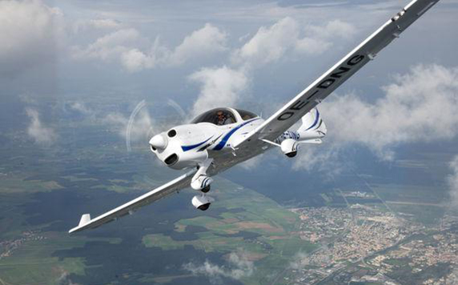

# Vol d'initiation

### Vol d'initiation chez EATIS : vous êtes le pilote
---
**L’école de pilotage EATIS Flight Academy vous propose de découvrir le « vol d’initiation » dans le ciel de Strasbourg. Ce vol vous permettra de passer un moment inoubliable et d’assouvir vos besoins de sensations fortes.**

Tout d’abord, vous serez accueilli dans notre centre de formation et ferez connaissance avec les pilotes instructeurs qui vous accompagneront pendant tout votre stage. Avant le vol d’initiation, vous aurez un cours théorique de 45 mn. Ensuite et pendant 30 mn, vous passerez réellement à votre vol d’initiation. Durant votre séance vous serez le pilote, c’est vous qui teindrez les commandes avec un pilote instructeur à vos côtés.

Sous son contrôle, vous roulerez alors jusqu’à l’aire de décollage puis décollerez, votre instructeur vous guidera verbalement pour assurer votre trajectoire de montée, mise en croisière, descente et enfin moment le plus palpitant, l’atterrissage sur l’aéroport. Vous vivrez un moment inoubliable en présence d’un instructeur professionnel d’EATIS qui saura vous mettre en confiance afin que vous puissiez apprécier pleinement le plaisir de votre premier vol !

### VOL D'INITIATION SUR DA 40

- 45 minutes de cours théorique dispensée par nos instructeurs. Vous apprendrez les bases du pilotage et le fonctionnement d’un avion. Vous apprendrez également à gérer votre stress en avion pour le bon déroulement de votre vol d’initiation
- Place maintenant à 30 minutes de vol aux commandes d’un d’un Diamond DA 40, le moment tant attendu de votre stage car c’est vous qui pilotez l’avion sous le regard de votre instructeur, de quoi passer un moment sensationnel !
- Un enregistrement vidéo vous sera remis à la fin du vol d’initiation.

::: tip TARIF DU STAGE : 
200 €

:::
::: warning A savoir :
Le stage et le vol d’initiation sont uniquement sur réservation. Age minimum 11 ans. Taille maxi 1.95m ou 110kg. Activité non réalisable pour les femmes enceintes, personnes souffrant de déficiences cardiaques ou personnes à mobilité réduite. Par ailleurs, la réalisation du vol d’initiation est soumise aux conditions météo.
:::